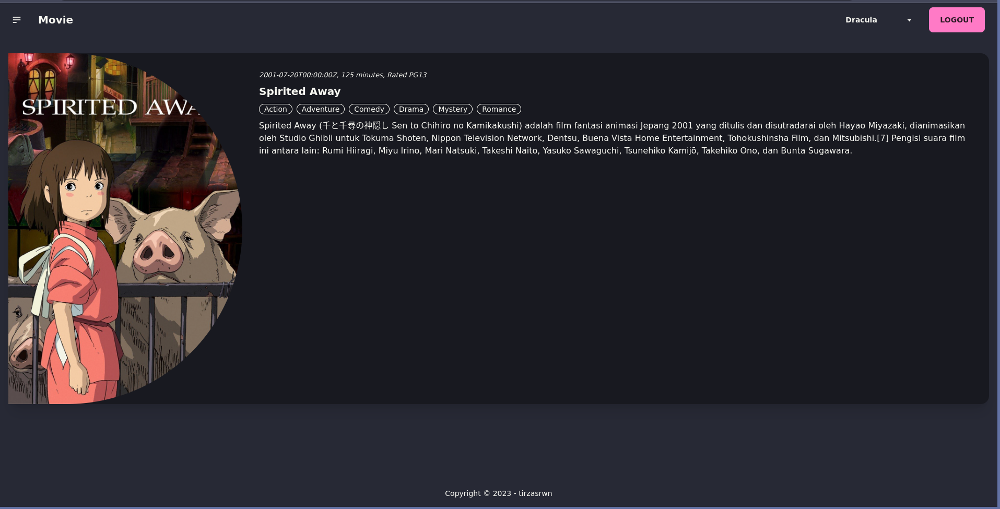

# Movie

## About

This's just a repository for me to learn about CRUD in modern web development.

## Stack

### Frontend

- Typescript
- React
- Tailwind CSS
- DaisyUI
- GraphQL

### Backend

- Go
- Gin
- Swagger API Documentation
- JWT
- Postgres
- GraphQL

### DevOps

- Docker
- Makefile

## Documentation

More documentation you can find it [here](./project/docs/readme.md). More visual documentation you can find in ./project/docs/images/ directory.
